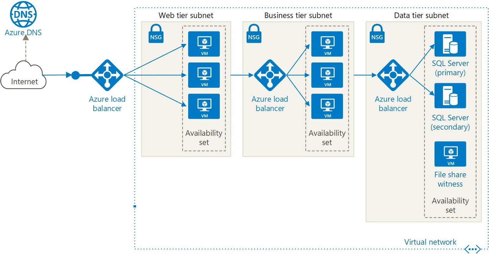

# Networking

- **Optimizes Application Performance & Scalability**: Networking helps improve how well your applications run and scale as needed.
- **Links Compute Resources**: It connects different computing resources and allows access to applications.
- **Efficient Traffic Control**: You can manage and control traffic coming into and going out of Azure, such as between your on-premises setup and Azure.

## Loosely Coupled Architecture

- **Architecture Behind Azure**: This refers to the way Azure’s services are structured.
- **Components**: Different services or parts of the system that exchange data with each other.
  - **Independence**: These components generally operate with minimal awareness of each other.
- **See also**: [Micro-services](./3.1.2.%20Containers.md#micro-services).
- 💡 **Why Recommended**:
  - **Independent Updates**: Each service can be updated on its own without affecting others, as long as the communication method remains consistent.
  - **Service Changes**: You can modify services without causing major disruptions to the entire system.
  - **Scalable**: You can adjust the scale of specific services as needed.
    - **Scaling Up/Down**: Increase or decrease the capacity of only those services that need it.
    - 💡 **Asynchronous Messaging**: Utilize Azure's messaging systems for scalable communication between services.

### N-tier Architecture

- **Usage**: This can help build loosely coupled architectures.
- **Tiers**: Divides an application into two or more layers, each with distinct roles.
  - **Access Rules**: A higher tier can interact with lower tiers, but lower tiers cannot access higher tiers.
- **Separation of Concerns**: Each tier addresses a specific aspect of the application, making it easier to manage and reuse.
- **Maintenance**: You can update or replace tiers independently, and add new tiers if necessary.
- *Three-Tier Example*: An application structured in three layers:
  - **Web Tier**: The front-end interface.
  - **Application Tier**: Handles the core application logic.
  - **Data Tier**: Manages database interactions.
  - 
    - **Access Rule**: Each tier interacts only with the tiers below it.
- [Read more](https://docs.microsoft.com/sv-se/azure/architecture/guide/architecture-styles/n-tier)

## Concepts

### Region

- **Definition**: A geographic area with one or more Azure data centers.
- **Examples**: East US, West US, North Europe.

### Azure Virtual Network

- **Purpose**: Lets you group and isolate related systems within Azure.
- **Description**: A logically isolated network in Azure.
- **Communication**: Enables secure interaction between Azure resources, VPNs, the internet, and on-premises networks.
- ❗ **Scope**: Limited to a single region.
- 💡📝 **Costs**:
  - Virtual networks, subnets, and network interfaces (NICs) are free.
  - Public IP addresses, reserved IPs, and certain network appliances like [VPN Gateway](#vpn-gateway) & [Application Gateway](./3.3.1.%20Load%20Balancing.md#azure-application-gateway) incur charges.
- **Connectivity**: You determine which networks your virtual network can connect to, whether public or private.

#### Subnet

- **Definition**: A way to divide a virtual network into smaller, manageable sections.
- **Purpose**: Helps in organizing and securing resources.
- **Example**: 
  - **Public Access**: The web tier might have a public IP address for user access.
  - **Private Access**: The application and data tiers have private IP addresses and are not directly exposed to users.

#### VPN Gateway

- 📝 **Also Known As**: Virtual Network Gateway.
- 📝 **Function**: Provides a secure connection between an Azure Virtual Network and an on-premises location over the internet.
- 📝 **Local Network Gateway**: Represents your on-premises network in Azure.
- **Example**: Allows you to keep some services on-premises while others are in the cloud.
- **Management**: Azure handles the physical hardware, while you configure virtual networks and gateways via software.
- 📝❗ **Deployment**: Must be set up in a dedicated subnet called the gateway subnet.

### Network Security Group (NSG)

- 📝 **Function**: Controls the traffic flow within a virtual network.
- **Purpose**: Allows or blocks inbound network traffic to Azure resources.
- **Analogy**: Acts like a firewall for your network.
- **Example**: 
  - **Web Tier**: Permits inbound traffic on ports 22 (SSH) and 80 (HTTP).
    - Port 22 allows SSH access to Linux systems.
    - Consider setting up VPN access for added security.
- 💡 **Best Practice**: Configure NSGs to accept traffic only from trusted IP addresses.

## Other Services

- **Azure ExpressRoute**: Provides high-bandwidth, secure connections to Azure.
- **Azure Network Watcher**: Monitors and troubleshoots network issues with scenario-based analysis.
- **Azure Virtual WAN**: Creates a unified wide area network (WAN) connecting multiple locations.
- **Network Protection Services**:
  - [Azure DDoS Protection](4.6.%20Network%20Protection.md#azure-ddos-protection)
  - [Azure Firewall](4.6.%20Network%20Protection.md#azure-firewall)
