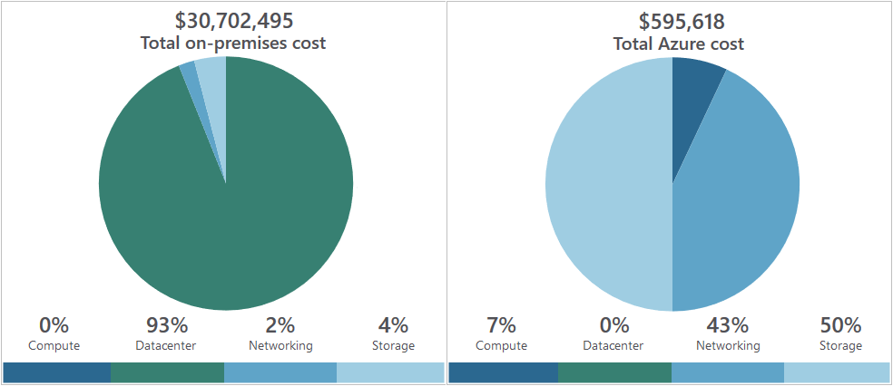

# Azure Costs & Tools

- Balancing cost with performance is an ongoing challenge.

## Usage Meters

- 📝 Usage meters help you determine Azure costs for each billing period.
- When you provision an Azure resource, Azure sets up one or more meters to track that resource.
  - These meters are charged based on how much the resource is used.
- Meters monitor the resource's usage and generate a record that is used to calculate your bill.
- Each meter tracks a specific type of usage.
- The usage tracked by a meter is converted into **billable units**.
  - These units are billed to your account at the end of each billing period.
- For example, when you deploy a virtual machine:
  - Azure might use meters to track:
    - Compute Hours, IP Address Hours
    - Data Transfer In, Data Transfer Out
    - Standard Managed Disk, Standard Managed Disk Operations
    - Standard IO-Disk, Standard IO-Block Blob Read, Standard IO-Block Blob Write, Standard IO-Block Blob Delete
  - 📝❗ If you de-allocate a VM, you won't be charged for the VM itself. However, any persistent disks associated with the VM will still incur charges.
- Meters and pricing can vary depending on the product.
- Pricing often has different tiers based on the resource’s size or capacity.

## Billing

- At the end of each monthly billing cycle:
  - The costs for your usage are billed to your payment method.
  - The meters are reset.
- To check your billing details, visit the billing page in the Azure portal:
  - View a summary of your current usage.
  - Access invoices from previous billing cycles.

## Factors Affecting Costs

### Resource Type

- Costs are specific to each resource.
- The type of resource determines how many meters are used and what they track.
- The cost per billable unit depends on the type of resource you are using.

### Services

- Different customer types, such as Enterprise, Web Direct, and Cloud Solution Provider (CSP), may have different Azure usage rates and billing cycles.
- Some subscription types include usage allowances which impact costs.
- Products and services from third-party vendors in the [Azure Marketplace](https://azuremarketplace.microsoft.com/) have different billing structures.

### Location

- Costs can vary based on the popularity, demand, and local infrastructure in a given location.
- For guidance on choosing cost-effective locations and regions, see [choose low-cost locations and regions](./6.4.%20Cost%20Optimization%20Best%20Practices.md#choose-low-cost-locations-and-regions).

### Bandwidth

- Bandwidth refers to data moving in and out of Azure data centers.
- 💡📝 Generally, inbound data (data sent to Azure) is free.
  - Outbound data transfers (data sent from Azure) are charged based on Billing Zones.
    - Transferring data between Azure regions counts as outbound data transfer.

#### Billing Zone

- A Billing Zone is a geographical area grouping Azure Regions for billing purposes.
- Each zone has different outbound data transfer prices.
- Zones are categorized as follows:
  - Zone 1: United States, US Government, Europe, Canada, UK, France, Switzerland
  - Zone 2: East Asia, Southeast Asia, Japan, Australia, India, Korea
  - Zone 3: Brazil, South Africa, UAE
  - DE Zone 1: Germany.

## Tools

### Azure Pricing Calculator

- A free, web-based tool: [https://azure.microsoft.com/en-us/pricing/calculator/](https://azure.microsoft.com/en-us/pricing/calculator/)
- Allows you to estimate costs without deploying or manually pricing out services from the Azure pricing pages.
  - 📝 Results can be saved in your Azure account, exported as Excel, or shared via URL.
- You can select Azure services and adjust their properties and options.
  - The calculator provides cost estimates per service and a total cost for the full setup.
  - Modifiable properties include:
    - **Region**: E.g., Southeast Asia, Central Canada, Western United States, Northern Europe...
    - **Tier**: E.g., Free Tier, Basic Tier, etc.
    - **Billing Options**: Based on customer and subscription types for the selected product.
    - **Support Options**: Includes or excludes paid support options.
    - **Programs and Offers**: Pricing offers based on customer or subscription type.
    - **Azure Dev/Test Pricing**: Available if your subscription is based on a Dev/Test offer.
- The pricing calculator page has several tabs:
  - **Products**: Lists all Azure services and lets you configure services for your estimate.
    - Customizable, e.g., for VMs you select region, OS, size, and running hours.
  - **Example Scenarios**: Common solutions that combine various components, e.g., VMs + load balancer.
  - **Saved Estimates**: Your previously saved cost estimates.
  - **FAQ**

### Azure Advisor

- A free service that provides recommendations on:
  - 📝 high availability, security, performance, operational excellence, and cost.
- Analyzes your deployed services and gives personalized advice.
- Cost-related recommendations include:
  - **Reduce costs by eliminating unprovisioned Azure ExpressRoute circuits**:
    - Finds circuits not provisioned for over a month.
    - Recommends deletion of these circuits.
  - **Buy reserved instances to save money compared to pay-as-you-go**:
    - Reviews your VM usage over the last 30 days.
    - Shows if you could save by purchasing reserved instances and highlights regions and sizes for potential savings.
  - **Right-size or shut down underutilized virtual machines**:
    - Monitors VM usage for 14 days.
    - Identifies underutilized VMs, suggesting scaling down or shutting them down to reduce costs.
    - For example, VMs with average CPU utilization of ≤ 5% (adjustable up to 20%).
    - Also identifies network usage ≤ 7 MB for more than 4 days.

### Azure Cost Management

- A free tool for in-depth cost analysis.
- Features include setting budgets, scheduling reports, and analyzing cost areas.
  - 📝 Provides historical breakdowns of services.
  - Tracks expenses against set budgets.

### Azure TCO Calculator

- Compares costs between on-premises and cloud environments.
  1. Describe your infrastructure: servers, databases, storage, networking.
  2. Adjust assumptions: e.g., VM costs, electricity costs, IT labor costs.
  3. Compare costs and see potential savings.
     - 
     - 
- A web-based tool: [azure.microsoft.com/pricing/tco](https://azure.microsoft.com/pricing/tco/)
- TCO stands for Total Cost of Ownership.
